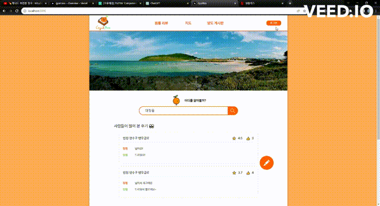
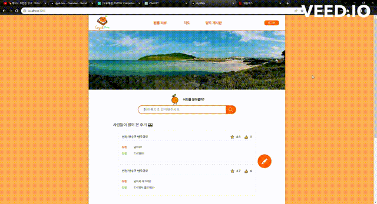
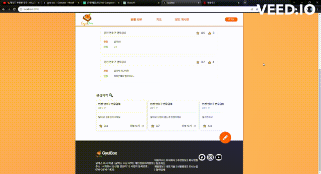
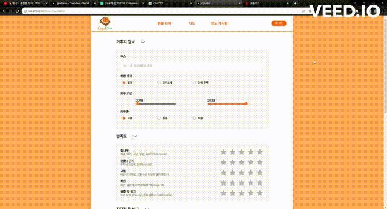
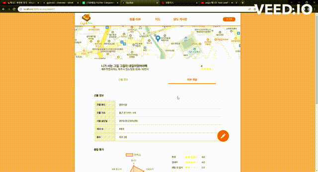
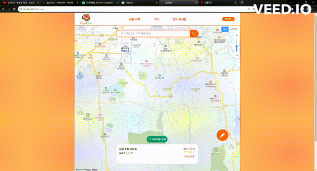
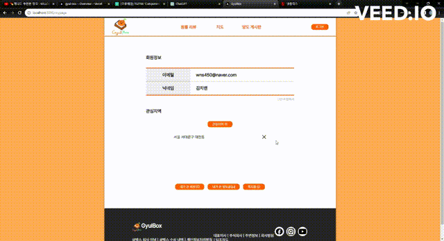

### ✅ 프로젝트 설명

제주도 한달살이 하는 사람들을 위한 커뮤니티 사이트입니다.

### 2023.04 ~ 2023.05

### **🛠️ 기술 스택**

#### 프론트엔드

    

#### 백엔드

       

#### CI/CD

      

### 메인

로그인 화면 모달

상하 이동 검색창

드래그 캐러셀

### 건물

에디터 페이지

리뷰 페이지

### 기타

위도별 리뷰 찾기

마이 페이지 관심지역 찾기

